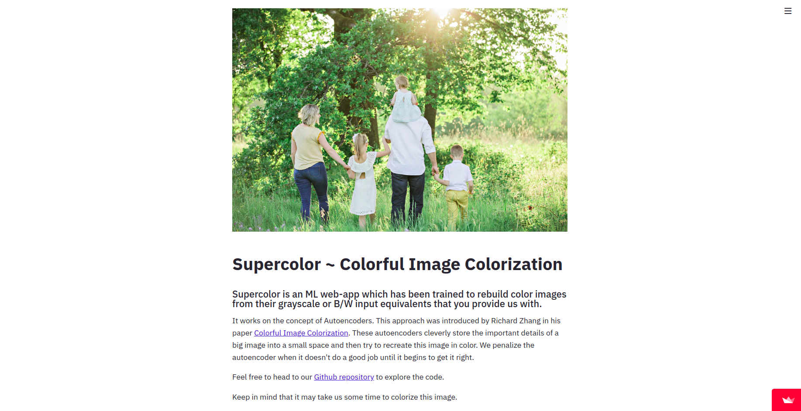
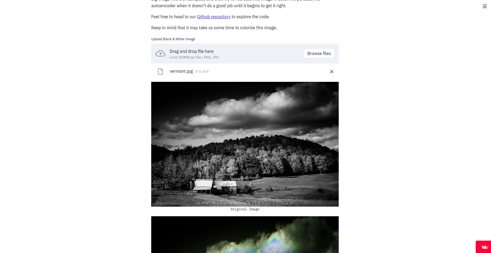
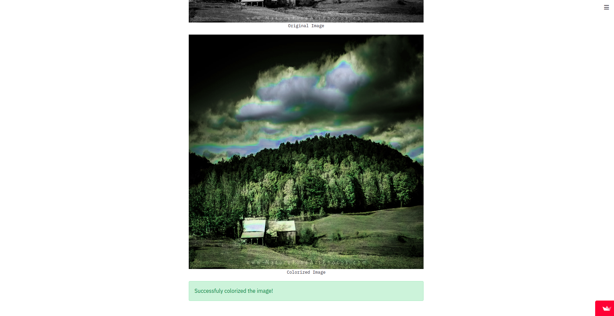

	<h2 align="center"> Image Colorization </h2>
	<h4 align="center"> Supercolor is an ML web-app which has been trained to rebuild color images from their grayscale or B/W input equivalents that you provide us with. <h4>

	
## Preview

- Demo:

  

- Browse images from your system and try out our image colorization model! 

## Functionality
- It works on the concept of Autoencoders. This approach was introduced by Richard Zhang in his paper [Colorful Image Colorization](https://arxiv.org/abs/1603.08511). These autoencoders cleverly store the important details of a big image into a small space and then try to recreate this image in color. We penalize the autoencoder when it doesn't do a good job until it begins to get it right.

Feel free to head to our [webapp](https://share.streamlit.io/data-science-community-srm/image-recolorization) and explore it for yourself.

## Contribute

You can check out our contributions, issues we faced and solutions we found in [Contribute.md](Contribution.md).
Feel free to fork this repository and make your own contributions.

## Contributors

<table align="center">
<tr align="center">

<td width:25%>

Abhishek Saxena

</td>

<td width:25%>

Aditya Shukla

</td>

<td width:25%>

Ansh Sharma

</td>

<td width:25%>

Harsh Sharma

</td>
</table>

## License

MIT © Data Science Community SRM

This project is licensed under the MIT License - see the [License.md](License.md) file for details

	Made with :heart:  by <a href="https://dscommunity.in">DS Community SRM</a>

